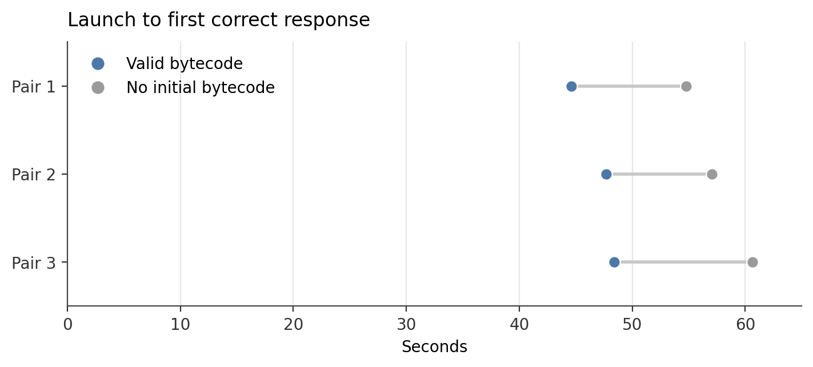

# Measurement supplement

This accompanies the bytecode article. Times below are recorded observations, not new benchmarks. MB and GB use decimal units. Serving and import plot data is in [measurements.csv](measurements.csv). The image-delivery plot data, including per-run pull and container-start times, and the complete numerical extract are in [supplementary-measurements.json](supplementary-measurements.json). The full original harnesses and raw logs remain in the author's research ledger and have not been published.

## Native serving

Native Linux vLLM serve launch to first correct HTTP completion; model local; common measured installed .py and .so pages resident; normal bytecode writes and multiprocessing retained.

| Pair | Precompiled (s) | No initial bytecode (s) | Paired saving (s) |
|---|---:|---:|---:|
| 1 | 44.618814008 | 54.748841574 | 10.130027566 |
| 2 | 47.691064560 | 57.039401972 | 9.348337412 |
| 3 | 48.405441556 | 60.638731790 | 12.233290234 |

Median paired saving: 10.130027566 s. Subtracting condition medians instead gives 9.348337412 s; that is a different statistic. Launch order: B1, C1, C2, B2, B3, C3, where B is precompiled and C begins without bytecode in the private installation. Normal bytecode writes remain enabled.

Before each launch, all 2,174,434 pages of the measured 23,273 installed Python/shared-library files were resident (8,852,520,345 bytes). B began with 21,870 caches; C began with zero and had 7,789 at completion. Residency covers this file set, not all filesystem metadata or model pages. CPU frequency and thermal state were not fixed. No OS-cold claim is made.

Environment: Linux, vLLM 0.28.0, Torch 2.13.0, CPython 3.12.3 (June 19, 2026 build, GCC 13.3.0), Qwen3-0.6B BF16, maximum model length 2048, RTX 4090 Laptop GPU. CPU affinity was 0–3, representing four logical CPUs on two SMT cores. The CPU model was not retained in this study's receipt.

## Direct source compilation

Fresh isolated process compiles the exact 5,118 preloaded source byte arrays; no module execution or bytecode writes.

| Pass | Whole-pass wall (s) | Current-thread CPU (s) |
|---|---:|---:|
| 1 | 6.246119038 | 6.245765872 |
| 2 | 6.303333864 | 6.302903434 |
| 3 | 6.319382935 | 6.318963402 |

Corpus: 5,118 files, 78,595,607 source bytes, 2,159,169 newline characters. Sources were loaded and hashed before the clock; whole-pass timings include compilation and discarding code objects. No module execution, per-file timing hook or cache writes in these passes. Fresh isolated CPython processes used -I -S -B. The Python build differs from the original native serving study; both are CPython 3.12.3.

The direct-compile study used CPython 3.12.3 (August 31, 2026 build, GCC 13.3.0) on the same host. Dependencies accounted for 94.4% of source bytes, and Torch contributed 1,276 files in the full serving-CLI corpus. The line count includes comments and docstrings and is not a count of executable statements. The 6.30-second standalone median is not an exact subtraction from the 10.13-second serving saving.

## Instrumented import diagnostic

One observation per condition, separately instrumented through the source loader. These are not the repeated primary import samples.

| Condition | Import wall (s) | Compiler-call wall (s) | Calls |
|---|---:|---:|---:|
| without_bytecode | 12.201944349 | 6.987958802 | 5118 |
| with_valid_bytecode | 5.009506710 | 0.000000000 | 0 |

The import difference is 7.192437639 s; compiler-call wall time is 6.987958802 s. Their difference is 0.204478837 s. Compiler-call time is part of the import clock. This is not an accounting partition of the full serving runs, and the diagnostic can include instrumentation/GC effects.

The September 15 diagnostic used the direct-compile installation: CPython 3.12.3 (August 31, 2026 build, GCC 13.3.0). The September 9 instrumented trace quoted in the PR used the June 19 CPython 3.12.3 build. It measured 13.855056 s uncached and 5.744176 s cached, an 8.110880 s import difference, with 8.196185 s inside 5,118 source-compiler calls. Compiler-call wall time exceeded that difference by 0.085305 s. The later trace's compiler-call time was 0.204479 s below its import difference. These are separate observations, not pooled samples. The effects of interpreter build and run conditions were not isolated; the earlier 8.623 s CPU figure measures process CPU, not compiler-thread CPU.

Receipts: September 9 `trace-B.json` and `trace-C.json`; September 15 `import-original.json` and `import-cached.json`.

## Independent import measurements

Fresh child process; clock begins immediately before import and excludes interpreter launch/preparation; common Python/native-library pages 100% resident; no compiler hook in the 24 primary observations.

The CSV supplies three observations per condition per root. Each root includes its dependencies; rows cannot be summed or subtracted to infer exclusive package costs. All plots show recorded observations and descriptive medians without inferred confidence intervals.

| Import root | No initial bytecode, median (s) | Valid bytecode, median (s) |
|---|---:|---:|
| `torch` | 2.13 | 0.80 |
| `transformers` | 1.29 | 0.68 |
| `vllm` | 6.71 | 2.11 |
| `vllm.entrypoints.cli.serve` | 12.27 | 5.02 |

The repeated import-root study used the August 31 CPython 3.12.3 build. All six processes per root had the same recorded module-presence result: bare Torch and bare Transformers loaded none of `torch._dynamo`, `torch._inductor` or `sympy`; vLLM and the serving CLI loaded all three. In installed vLLM 0.28.0, the package initializer imports `vllm.env_override`, whose fallback-list patch imports Inductor lowering. This identifies one eager path, not the exclusive cause of the incremental import time or current-main behavior. Receipt: September 15 package study `ANALYSIS.json` and its saved source context.

## Image delivery

Matched CUDA images from separate empty classic-overlay2 Docker stores through loopback pull/unpack to first correct response; model already local; gzip export in both arms; host/source page cache warm or uncontrolled.

| Pair | Control gzip (s) | Bytecode gzip (s) | Paired saving (s) |
|---|---:|---:|---:|
| 1 | 149.815616736 | 134.454980230 | 15.360636506 |
| 2 | 155.726505630 | 144.513727492 | 11.212778138 |
| 3 | 162.384975863 | 146.280619865 | 16.104355998 |

Median paired saving: 15.360636506 s. Subtracting condition medians instead gives 11.212778138 s; that is a different statistic. The preregistered order was three rotated triples: A1 B1 C1, C2 A2 B2, B3 C3 A3, where A is the control, B the bytecode image and C the excluded zstd condition. Pairs 1 and 2 ran the control first; pair 3 ran bytecode first. Complete clocks rose through the session in both arms; CPU frequency, thermal state and registry state were not fixed. Three pairs establish the observed range, not a precise fleet-wide effect.

The harness recorded pull/unpack and container launch to first correct response within the same monotonic clock. The precompiled image's pull/unpack took 3.434 s less, 2.465 s more and 1.169 s more in pairs 1–3. Its launch-to-response interval took 11.925 s, 13.673 s and 17.276 s less. Pull time varied in both directions; every pair improved in the launch interval. The experiment did not isolate a bytecode-induced pull cost or test bandwidth-limited delivery.

Encoded layer bytes: 8,511,741,380 control versus 8,664,824,384 candidate; +153,083,004 bytes (+1.798492191%). The loopback registry was uncapped; image stores were empty, model files local, host pages warm or uncontrolled. The full historical run also included a zstd condition; its cells are excluded from this bytecode comparison. Build timings were not a matched experiment and are not used to infer build overhead.

Environment: vLLM source `470fe3942ecdb889b2f3c0b57ace4b09d61dd103`, Docker 29.1.3, Intel Core i9-13900HX, RTX 4090 Laptop GPU, four-logical-CPU daemon affinity and a four-CPU server quota. These hardware records belong to the image-delivery study; the native serving receipt did not independently record the CPU model.

The images used CPython 3.12.3 (July 15, 2026 build, GCC 13.3.0), Torch 2.13.0+cu130 and uv 0.12.10. The runtime target was `vllm-openai`, built for CUDA architecture 8.9. The source checkout reported version `0.1.dev1+g470fe3942`; this was not the released vLLM 0.28.0 image used elsewhere in the investigation. Both derived build recipes required the same host-networking correction for the test machine and differed only by `ENV UV_COMPILE_BYTECODE=1`. Both forced fresh runtime-package installation while reusing native build stages. The setup durations do not isolate bytecode build overhead.

### Image identity and bytecode use

The identity check compared interpreter version and executable hash, 244 Python distribution versions, 483 system package versions, Python source hashes, native payload hashes and all other installed-package payload bytes. The inventory covers `/usr/local/lib/python3.12/dist-packages`. Bytecode and package `RECORD` files are excluded from the payload comparison because the treatment changes them. All 17,341,585,327 compared payload bytes matched.

| Check | Default build | Precompiled build |
|---|---:|---:|
| Installed package source files | 26,734 | 26,734 |
| Sources with valid bytecode | 407 | 26,734 |
| Sources missing bytecode | 26,327 | 0 |
| Bytecode bytes, uncompressed | 5,010,861 | 423,003,516 |
| Serving-CLI source compiler calls | 5,257 | 0 |

The source-compilation probes ran in fresh read-only containers, with network disabled, a four-CPU quota, `PYTHONDONTWRITEBYTECODE=1` and `python3 -B`. Cache writes were disabled; existing caches could still be read. The precompiled image was then run unchanged with `-X pycache_prefix=/tmp/ibz0907-bypass`, pointing lookup at a fresh tmpfs directory. That restored 5,478 source compiler calls. The count exceeds the default image's 5,257 because the override also bypasses standard-library caches. This is evidence of cache use, not a third equivalent latency arm. All three probes exited successfully.

Every measured activation passed the saved CPU/Transformers next-token checks. Four additional 16-token request bursts per activation matched generated choices and usage across arms. These checks cover this pinned model and environment.

The machine-readable extract includes these checks under `image_cache_identity`. The original receipts are `identity-gate.json`, `inventory-A.json`, `inventory-B.json`, `import-A.json`, `import-B.json` and `import-bypass-B.json` in the September 7 image study. Their SHA-256 hashes are listed under `image_cache_identity.source_receipts` in the JSON; the original files have not been published with this post.

## Official image probe

On September 3, 2026, the inspected `vllm/vllm-openai:latest` image (digest `sha256:61fc8a896b0a4fbbbdc063bc4b0dbc25ce98e02b5050c24aeb7830ac02039b14`, vLLM 0.28.0, Torch 2.13.0+cu130) contained 408 `.pyc` files and 27,753 `.py` files under `/usr/local/lib/python3.12/dist-packages`. These are raw file counts, not per-source validity checks. That published image differs from the matched test images, and this is a dated inventory rather than a claim about today's `latest` tag. Receipt: September 3 image-bytecode probe and its recorded image inspection.

## Final-image diagnostic

The article's missing-cache command was run on September 22 with CPython 3.12.3 in the retained official image identified above, using a read-only root, no network and no GPU access. Across all three directories returned by `site.getsitepackages()`, it reported **27,345 of 28,088 installed `.py` files with no `.pyc`**. This is wider than the September 3 `/usr/local/lib/python3.12/dist-packages` inventory, and checks file existence rather than header validity. A separate two-source fixture reported two missing caches before compilation and zero afterward using the same code and interpreter. `-B` kept the diagnostic itself from writing caches.

The diagnostic source, interpreter details and observations are in [cache-coverage-check.json](cache-coverage-check.json).

These are diagnostic checks, not new startup measurements or a repeat of the matched-image validity inventory.

## The three cache layers

| Cache | What it saves |
|---|---|
| OS page cache | Reading file contents from storage; source still needs compiling if bytecode is missing |
| Python `.pyc` files | Compiling source into code objects; module initialization still runs |
| Python `sys.modules` | Importing a module again within the same interpreter |

Only `.pyc` availability is the intended treatment in the native comparison. All trials use a fresh server process; residency of the measured common source/native-library pages is checked before launch. Normal `.pyc` writes and parent/child reuse remain enabled.

## Compatibility and build caveats

- **Check the final image.** The setting applies to uv operations. It doesn't automatically fill every cache inherited from a base image, and caches left in a builder stage won't help the running container. Coverage depends on the command and uv version. [uv's install reference](https://docs.astral.sh/uv/reference/cli/#uv-pip-install--compile-bytecode) describes the behavior.
- **Use the target Python and retain source.** CPython validates caches according to their invalidation mode. Compatible bytecode is independent of CPU architecture: a small fixture compiled on an ARM Mac loaded unchanged on x86-64 Linux with source compilation blocked. Native extensions and container images still have their own platform constraints. Stale or incompatible caches can fall back to source; arbitrary corruption is not guaranteed to recover cleanly. See [CPython's cache-invalidation rules](https://docs.python.org/3.12/reference/import.html#cached-bytecode-invalidation).
- **Check reproducibility and emulated builds if you depend on them.** Upstream reports cover bytecode serialization differences that change image digests despite equivalent disassembly ([uv #10619](https://github.com/astral-sh/uv/issues/10619), [CPython #129724](https://github.com/python/cpython/issues/129724)), and compilation hangs under QEMU user-mode emulation ([uv #6105](https://github.com/astral-sh/uv/issues/6105)). Those build paths need their own validation.

## Interpretation

The native serving, standalone compiler, instrumented import, repeated imports and image-delivery series have different timing boundaries. They support related conclusions but cannot be combined into a single additive startup waterfall. All performance studies were on one host; broader hardware, dependency versions, model sizes, external networks and steady-state throughput require separate validation.
